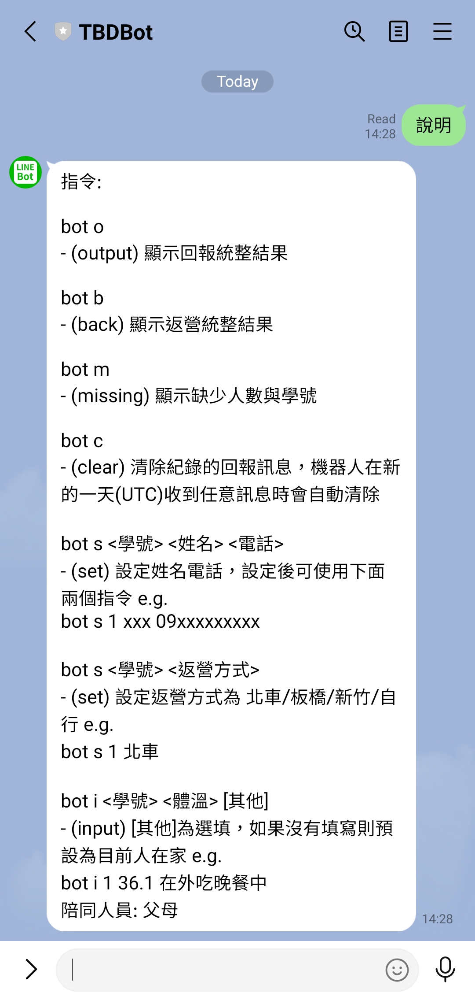
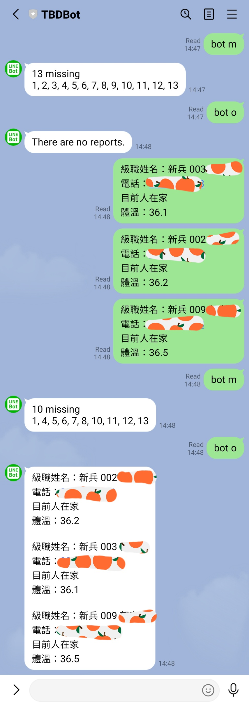
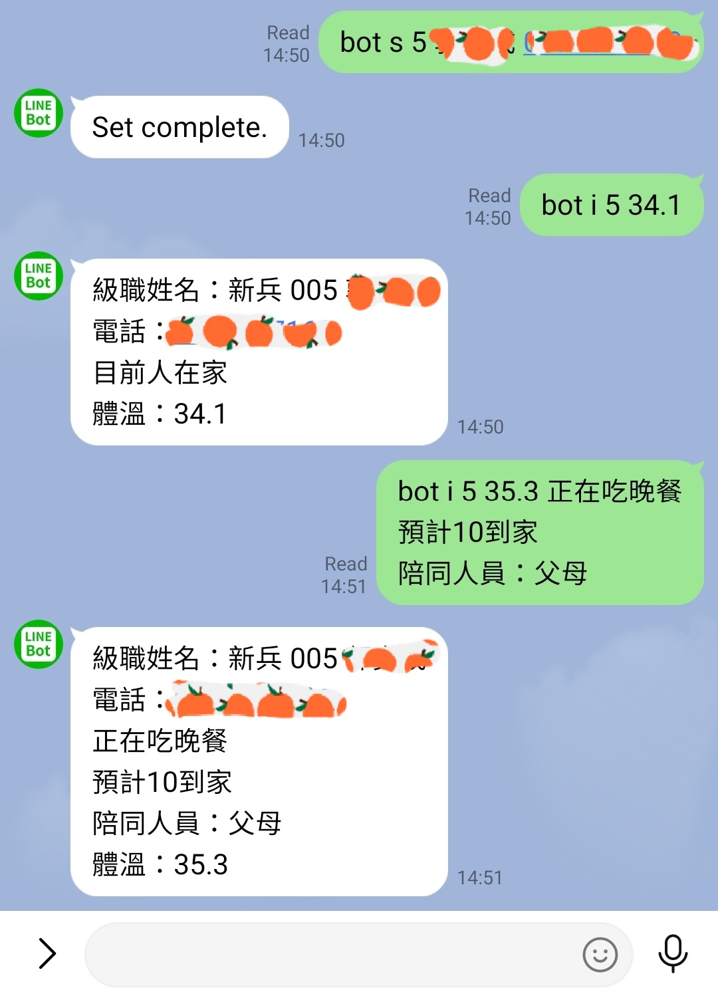
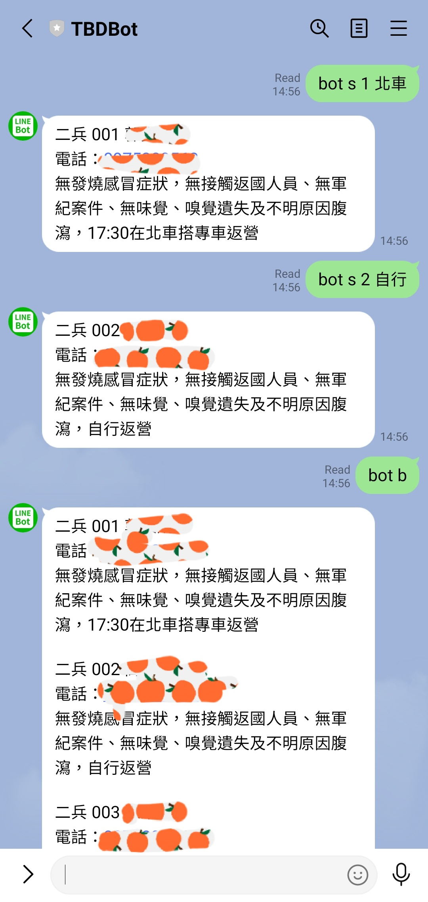

# line-bot-gas

A line bot for summary certain user messages. Build using GAS(Google Apps Script) linked with Google Sheets. Reference: [實作 LINE 聊天機器人 ( Google Apps Script )](https://www.oxxostudio.tw/articles/201804/line-bot-apps-script.html)

服兵役的訓員在休假時，要在班級的 LINE 群組內回報給班長。linebot 的功能：

- 統整訓員們的回報
- 提供簡短的回報方式
- 收假方式的回報。

## Screenshots

**指令說明**

  

**統整回報**

  

**Shorthand**

  

**收架返營方式回報**

  

